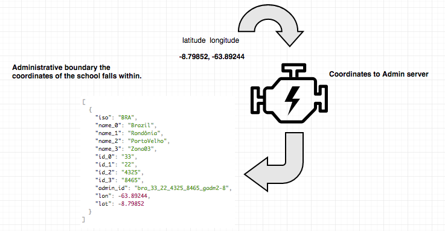

Latitude/longitude coordinates to admin ID server
=================================================

[](https://gitter.im/unicef-innovation-dev/Lobby)
[](https://travis-ci.org/unicef/coordinates_to_admin_id_server)

[This is a component of Magic Box](https://github.com/unicef/magicbox)

API that takes latitude/longitude pairs and returns an ID and metadata for the
administrative boundaries they're located within



### Example
	curl http://localhost:8082/api/coordinates/33.385586,66.445313
#### returns ...
```
{
  "iso": "AFG",
  "name_0": "Afghanistan",
  "name_1": "Daykundi",
  "name_2": "Gizab",
  "admin_id": "afg_1_6_53_gadm2-8",
  "lon": 66.445313,
  "lat": 33.385586
}
```

### Dependencies:

#### NVM
	curl -o- https://raw.githubusercontent.com/creationix/nvm/v0.32.1/install.sh | bash

#### Node.js
	nvm install 8


### Prerequisites
- [download_shapefiles_from_gadm](https://github.com/unicef/download_shapefiles_from_gadm)
- [import_shapefiles_to_postgres](https://github.com/unicef/import_shapefiles_to_postgres)

### Setup
	git clone https://github.com/unicef/coordinates_to_admin_id_server
	cd coordinates_to_admin_id_server
	cp config-sample.js config.js
	npm install
	npm run build


#### Batch example
curl http://localhost:8082/api/coordinates/33.385586,66.445313,-16.351768,-45.703125

##### Note to pairs of coordinates in the url. This returns:

```
[
  {
    "iso": "AFG",
    "name_0": "Afghanistan",
    "name_1": "Daykundi",
    "name_2": "Gizab",
    "admin_id": "afg_1_6_53_gadm2-8",
    "lon": 66.445313,
    "lat": 33.385586
  },
  {
    "iso": "BRA",
    "name_0": "Brazil",
    "name_1": "MinasGerais",
    "name_2": "Riachinho",
    "name_3": "Riachinho",
    "admin_id": "bra_33_13_2179_4369_gadm2-8",
    "lon": -45.703125,
    "lat": -16.351768
  }
]
```
